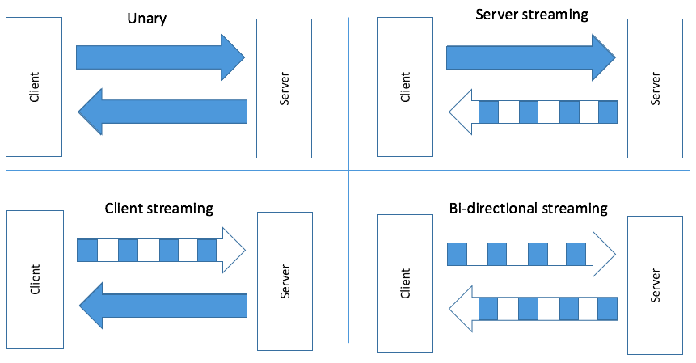

# gRPC

gRPC is a high-performance, open-source framework for building remote procedure call (RPC) APIs. It is based on the Protocol Buffers data serialization format, and uses the HTTP/2 protocol for transport. gRPC enables client and server applications to communicate transparently, and supports a wide variety of programming languages. It is commonly used in backend systems to expose functionality to other systems or clients, and can be used in microservices architectures.

# API Calls

